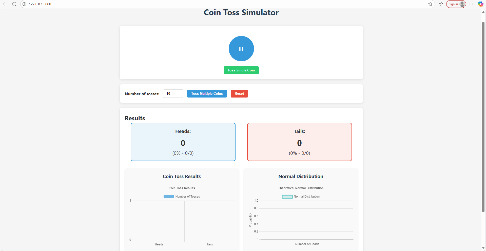
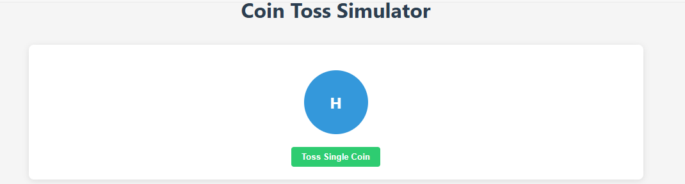
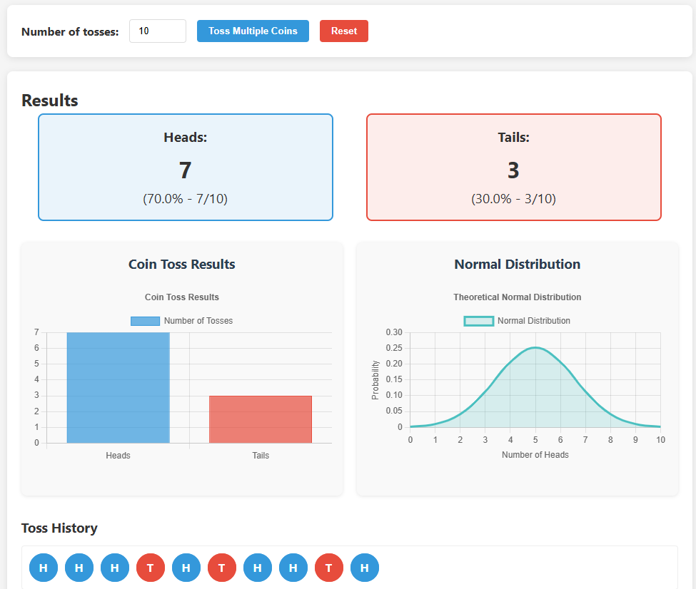

# Coin Toss Simulator

A web-based application that simulates coin tosses with visual animations, statistical analysis, and probability visualization. Perfect for educational purposes or just for fun!



## 🌟 Features

- **Realistic Coin Animation**: Watch a 3D coin flip with smooth animations
- **Single & Multiple Tosses**: Toss one coin at a time or multiple coins simultaneously
- **Statistical Analysis**: Track heads and tails counts with percentages and fractions
- **Interactive Charts**: 
  - Bar chart showing results distribution
  - Normal distribution graph for probability visualization
- **Toss History**: Review your last 50 toss results
- **Responsive Design**: Works perfectly on desktop, tablet, and mobile devices

## 🚀 Live Demo

[View Live Demo]([https://your-live-demo-link-here.com](https://coin-toss-simulator-2.onrender.com))

*Note: Replace with your actual deployment link*

## 📸 Screenshots

### Main Interface


### Coin Animation


### Charts & Statistics


## 🛠️ Installation

### Prerequisites
- Python 3.6 or higher
- Flask (if using the backend version)

### Method 1: Using Flask (Recommended)

1. Clone or download the project files
2. Navigate to the project directory:
   ```bash
   cd coin-toss-simulator


Install required dependencies:

bash
pip install -r requirements.txt
Run the application:

bash
python app.py


📁 Project Structure
coin-toss-simulator/
├── app.py                 # Flask backend server
├── simple_server.py       # Simple HTTP server (no Flask)
├── requirements.txt       # Python dependencies
├── static/
│   ├── css/
│   │   └── style.css      # Styling for the application
│   ├── js/
│   │   └── script.js      # Core functionality and animations
│   └── images/            # Application images
├── templates/
│   └── index.html         # Main HTML page
└── images/                # Screenshots for documentation


🎮 How to Use
Single Coin Toss: Click the "Toss Single Coin" button to flip one coin with animation

Multiple Coin Tosses:

Enter the number of tosses in the input field

Click "Toss Multiple Coins" to simulate multiple tosses

Reset: Click "Reset" to clear all results and start over

View Statistics: Check the charts section to see visual representations of your results

📊 Mathematical Foundation
The application demonstrates several probability concepts:

Binomial Distribution: Coin tosses follow a binomial distribution with p=0.5

Normal Approximation: For large numbers of tosses, the binomial distribution approximates a normal distribution

Law of Large Numbers: As the number of tosses increases, the experimental probability approaches the theoretical probability (50% heads, 50% tails)
The normal distribution graph shows the theoretical distribution based on:

Mean (μ) = n × p = n × 0.5

Standard Deviation (σ) = √(n × p × (1-p)) = √(n × 0.5 × 0.5) = √(n)/2


🛠️ Technology Stack
Frontend: HTML5, CSS3, JavaScript (ES6+)

Charts: Chart.js

Backend (Optional): Python with Flask

Animations: CSS 3D transforms and transitions

🌐 Deployment
Deploy to Render

For Live Demo
[View Live Demo]([https://your-live-demo-link-here.com](https://coin-toss-simulator-2.onrender.com))
